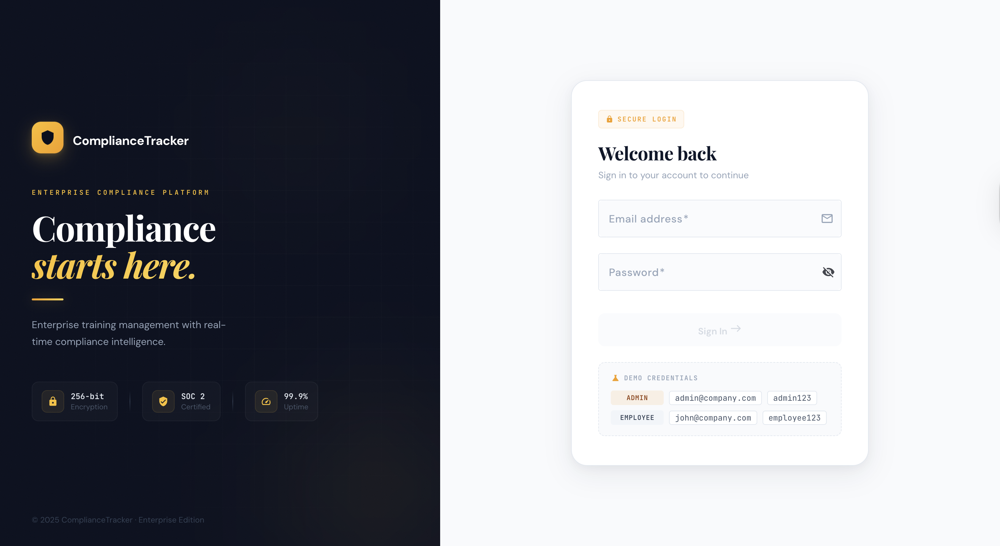
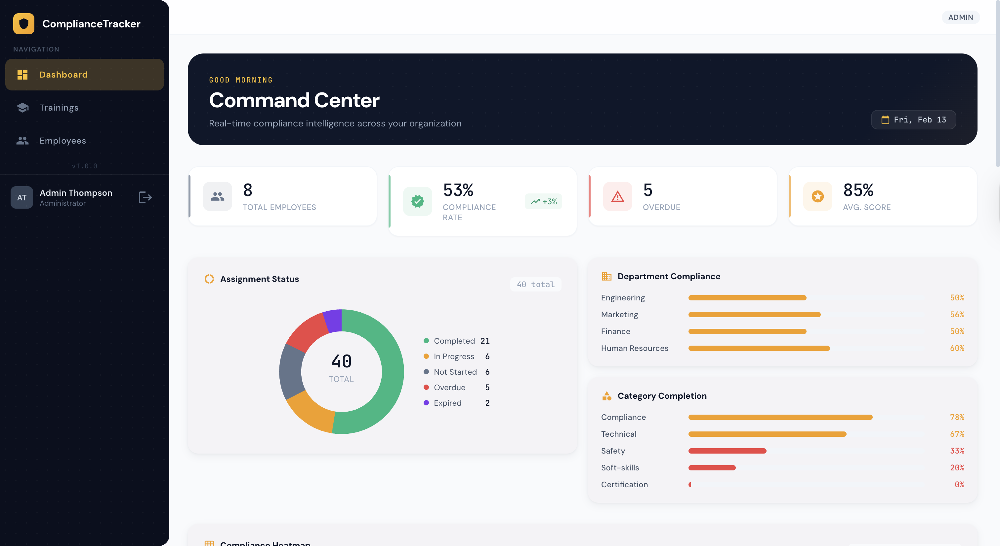
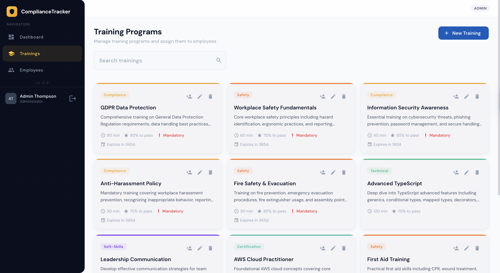
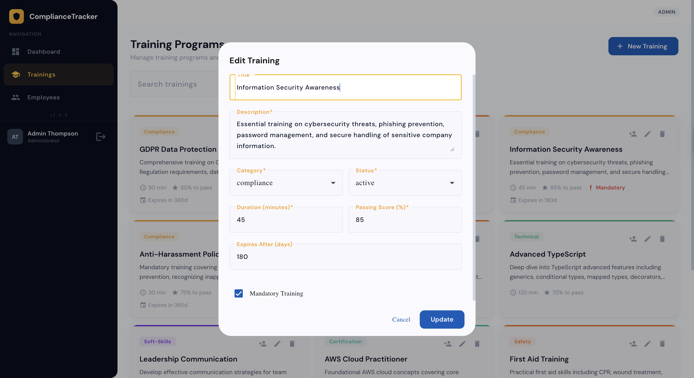
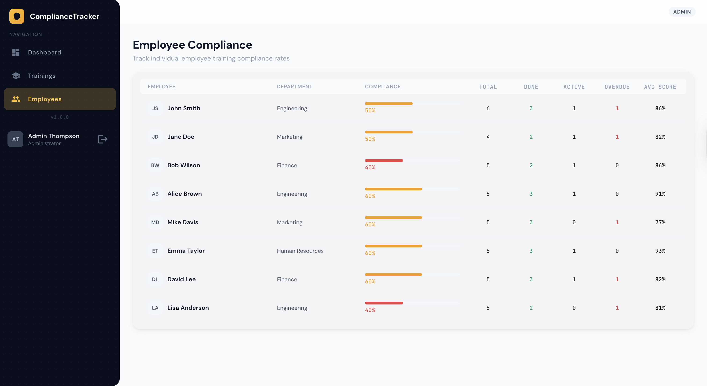
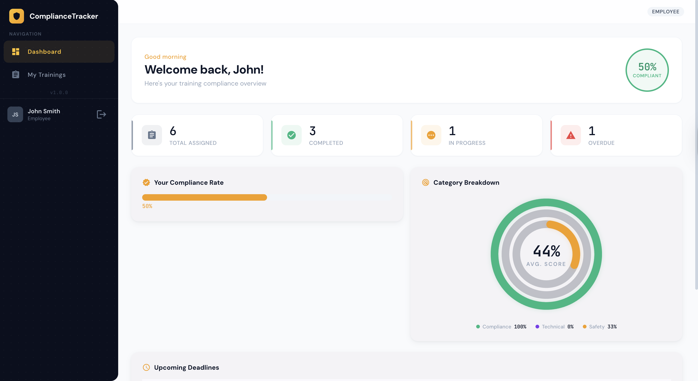
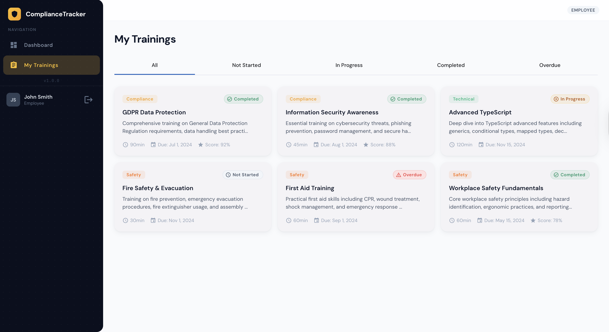

# Compliance Tracker

An Angular application for managing employee training compliance. Features role-based dashboards for admins and employees, training assignment workflows, and compliance monitoring with visual analytics.

## Features

**Admin**
- Dashboard with compliance overview, heatmaps, and score distributions
- Training management (create, edit, list)
- Employee compliance tracking table
- Assign trainings to employees via dialog

**Employee**
- Personal dashboard with compliance progress
- Training list with status tracking
- Training detail view with assignment timeline

**Shared**
- Role-based authentication (admin/employee)
- Route guards for authorization
- Visual components: charts (bar, donut, radial), heatmap, stat cards, status badges

## Screenshots

### Authentication



### Admin






### Employee




## Tech Stack

- Angular 20 with standalone components and lazy-loaded routes
- Angular Material + CDK
- D3.js for data visualizations
- SCSS for styling
- Mock data services (no backend required)

## Getting Started

```bash
npm install
ng serve
```

Navigate to `http://localhost:4200/`. The app redirects to the login page where you can sign in as an admin or employee.

## Docker

```bash
# Production build served by nginx
npm run docker:prod

# Development with hot reload
npm run docker:dev
```

The production image uses a multi-stage build (Node → nginx) and serves the app at `http://localhost:8080`.

## CI/CD

GitHub Actions workflows run automatically:

| Workflow | Trigger | What it does |
|---|---|---|
| **CI** | PRs + pushes to `main` | Runs tests and builds |
| **Deploy** | Push to `main` | Deploys to GitHub Pages |
| **Docker** | Push to `main` | Pushes image to GHCR |

Live site: https://ShababiMahdiyar.github.io/compliance-tracker/

## Build

```bash
ng build
```

## Tests

```bash
ng test
```
